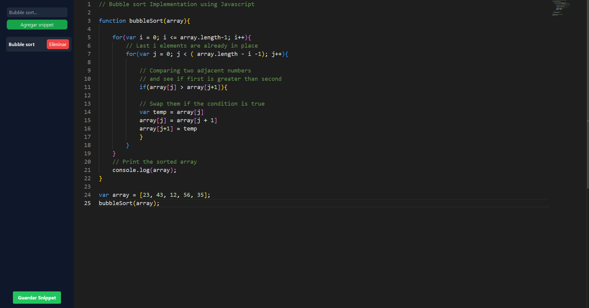

# Snippets-App 

## Description
Esta es una aplicacion sencilla creada con el fin de poder guardar y organizar snippets de codigo, para poder acceder a ellos de manera rapida y sencilla.

## Motivacion
Esta aplicacion fue creada con el fin de poder aprender a utilizar la tecnologia [Tauri](https://tauri.studio/en/) para crear aplicaciones de escritorio con tecnologias web.

## Screenshots


## Instalacion

```bash
 $npm install

 or 

 $yarn install   
```

## Ejecucion

```bash
 $npm run tauri dev

 or 

 $yarn tauri dev
```

## Compilacion

```bash
 $npm run tauri build

 or 

 $yarn tauri build
```

## Tecnologias

- [Tauri](https://tauri.studio/en/)
- [Typescript](https://www.typescriptlang.org/)
- [Node](https://nodejs.org/en/)
- [Vite](https://vitejs.dev/)
- [Tailwindcss](https://tailwindcss.com/)
- [React](https://reactjs.org/)


